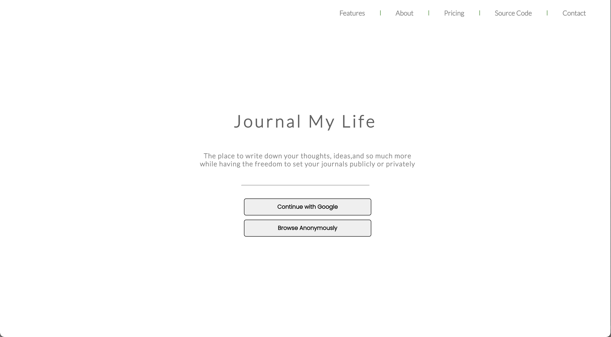
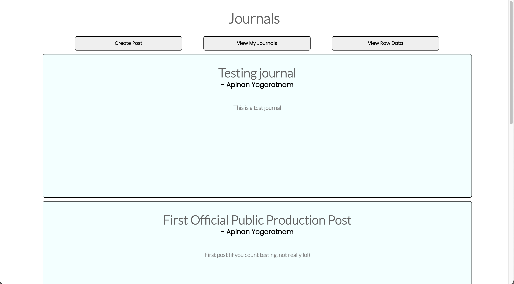
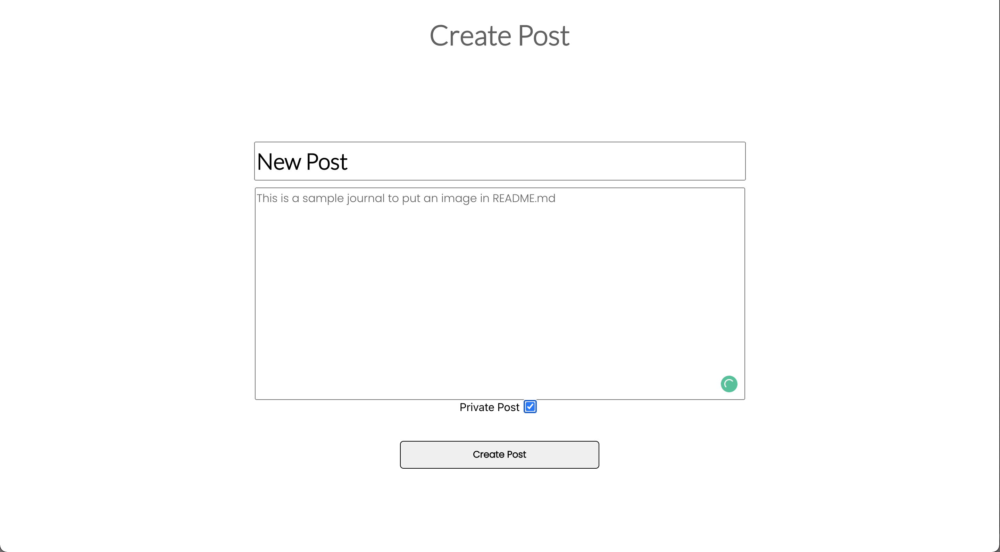
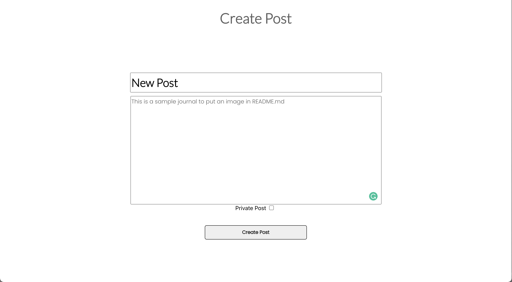
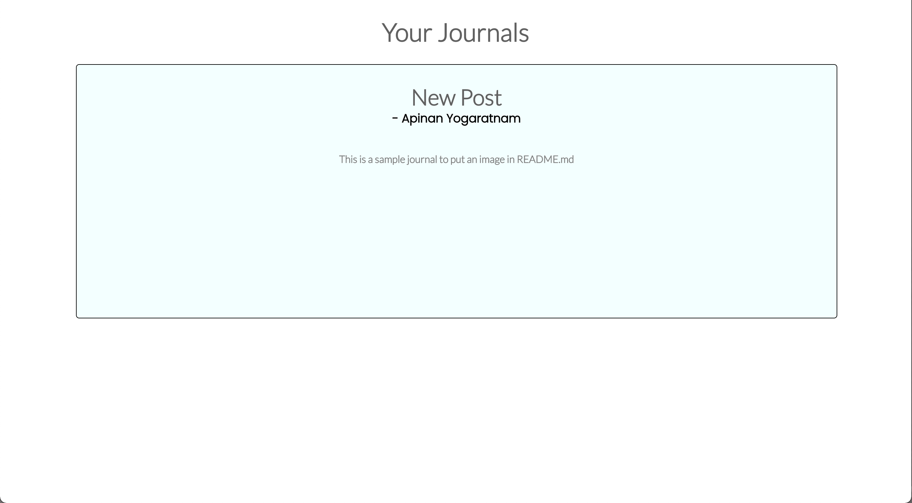

# Journal My Life FullStack Web Application

## Website: `https://journal-my-life.herokuapp.com/`

### Design

# WARNING: DO NOT PUT SENSITIVE INFORMATION WHEN CREATING A JOURNAL

## Run locally
1. clone the repository
2. change directory to journal-my-life
3. npm i
4. npm start

## Features
- Create A Journal
- View Your Journals
- View all Public Journals
- View your raw data
- Continue with Google
- Continue Anonymously

## About
API was built using Flask (update API code)
Frontend was built using React.js
